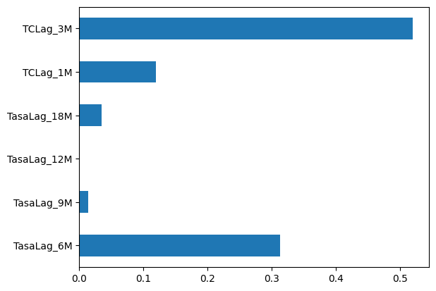

Análisis de Rezagos de la Política Monetaria de Banxico usando Machine Learning

Resumen del Proyecto
Este proyecto es una investigación cuantitativa que busca medir el impacto y los rezagos del mecanismo de transmisión de la política monetaria del Banco de México.

El objetivo principal no es predecir la inflación, sino interpretar qué palancas de política (Tasa Objetivo vs. Tipo de Cambio) y qué rezagos de tiempo (ej. 6, 12, o 18 meses) son los más importantes para explicar el comportamiento de la inflación en México.

Para lograrlo, se utiliza un modelo de Machine Learning (RandomForestRegressor) no como una herramienta para predicción, sino como una herramienta de interpretación para extraer la "importancia de las variables".

Stack Tecnológico y Datos
Datos: API del Sistema de Información Económica (SIE) de Banxico.

SF61745: Tasa Objetivo (Tasa de fondeo bancario).

SP1: Inflación (INPC General Anual).

SF43718: Tipo de Cambio (FIX).

Análisis y Modelado: Python, Pandas, Scikit-learn (RandomForestRegressor, MinMaxScaler, train_test_split).

Visualización: Matplotlib y Seaborn.

Flujo de Trabajo: El proyecto está estructurado en scripts (.py) para utilidades y notebooks (.ipynb) para el análisis, todo versionado con Git y gestionado con un entorno virtual (venv).

Metodología y Flujo de Trabajo

El proyecto siguió un flujo de trabajo de 3 fases:

Fase 1: Ingeniería y Exploración de Datos
Extracción: Se construyó una función (banxico_utils.py) para conectarse a la API del SIE y descargar las 3 series de tiempo desde 2008 hasta la fecha.

Limpieza: El desafío principal fue la homologación de frecuencias. Para crear un DataFrame maestro mensual, se aplicó una lógica distinta a cada serie:

Tipo de Cambio (Diario): Se remuestreó a mensual usando el promedio (.resample('M').mean()).

Tasa Objetivo: Se usó la lógica de "estado vigente", tomando el último valor conocido a fin de mes (.resample('M').asfreq().ffill()).

Exploración: Un heatmap de correlación simple reveló un hallazgo clave: una alta correlación positiva entre la Tasa y la Inflación en el mismo mes. Esto no demostraba el impacto de la Tasa, sino la "función de reacción" de Banxico (Banxico sube la tasa porque la inflación sube). Esto justificó la necesidad de usar un modelo de rezagos.

Fase 2: El Hallazgo del "Cambio de Régimen"
Ingeniería de Variables: Se transformó el problema de series de tiempo en uno de regresión supervisada usando .shift() para crear las variables X (rezagos de Tasa, TC, e Inercia de Inflación) para predecir la Y (Inflación actual).

Fracaso de la Predicción: Al dividir los datos con train_test_split(shuffle=False), el modelo falló.

R² Train (2009-2021): ~0.99 (sobreajuste extremo).

R² Test (2022-2025): ¡Negativo! (ej. -40.75).

Se intentó hacer una poda extrema ajustando los hiperparámetros, sin embargo, los resultados no cambiaban mucho.

Esto demostró un cambio de régimen estructural. Las reglas económicas que el modelo memorizó en el periodo pre-COVID (2009-2021) se rompieron y fueron inútiles para predecir el mundo post-COVID (2022-2025).

Fase 3: 
Dado el cambio de régimen, el objetivo de predicción se descartó. Se tomó la decisión de entrenar un modelo final con el 100% de los datos (2009-2025) con el único propósito de interpretar el panorama completo.

Para forzar al modelo a encontrar las palancas de política, el modelo final se entrenó:

Se excluyó la variable Inflacion_lag_1M para evitar que el modelo tuviera un enmascaramiento de Variables causado por un predictor dominante.

Con Poda Extrema: Se usaron hiperparámetros restrictivos (max_depth=3, min_samples_leaf=10) para forzar al modelo a encontrar solo los patrones más simples y robustos.

Resultados 
El análisis de feature_importance_ del modelo final reveló los siguientes hallazgos:

TCLag_3M (Tipo de Cambio, 3 meses): 52.0%

TasaLag_6M (Tasa Objetivo, 6 meses): 31.3%

TCLag_1M (Tipo de Cambio, 1 mes): 11.9%

TasaLag_18M (Tasa Objetivo, 18 meses): 3.4%

TasaLag_9M (Tasa Objetivo, 9 meses): 1.4%

TasaLag_12M (Tasa Objetivo, 12 meses): 0.0%

Conclusión

Los resultados del modelo sugieren que el mecanismo de transmisión de la política monetaria opera más rápido de lo que la teoría clásica supone y que el canal del tipo de cambio es el dominante.

La interpretación es que cuando Banxico cambia la Tasa Objetivo, esto a su vez cambia el interés de los inversionistas extranjeros en invertir en bonos gubernamentales. Esto provoca una inyección de dólares en México, aumentando la demanda del peso y apreciándolo.

En sí, el cambio podría decirse que es indirecto: la primera acción es la reacción de Banxico (TasaLag_6M con 31% de importancia), pero esta a su vez cambia el Tipo de Cambio, y es esta última variable (TCLag_3M con 52% de importancia) la que tiene un mayor efecto sobre la inflación. Los rezagos largos tradicionales (12-18 meses) parecen ser irrelevantes en este conjunto de datos.